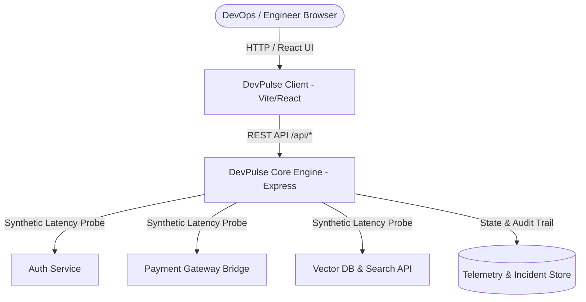

<div align="center">
  <h1>⚡ DevPulse</h1>
  <p><strong>Real-time Microservice Latency & API Health Observability Suite</strong></p>

  <p>
    <a href="https://github.com/Shahar-Yar095/devpulse/actions"></a>
    <a href="./LICENSE"></a>
    
    
    
  </p>
</div>

---

## 📌 Overview

**DevPulse** is a lightweight, real-time observability and service status monitor designed to provide engineering teams with sub-second health visibility across distributed microservices and third-party APIs.

Built with an **Express / Node.js** modular REST API and a high-performance **React / Vite** reactive telemetry dashboard, DevPulse delivers instant latency pings, 30-day SLA calculations, historical latency charts, and an incident triage workflow.

---

## 🚀 Key Features

- **Synthetic Ping & Latency Tracking**: Execute instant health checks on monitored endpoints and visualize response jitter in real time.
- **System SLA Aggregation**: Computes overall system uptime percentages and operational ratios across critical, high, and standard service tiers.
- **Incident Audit Trail**: Lifecycle management for system anomalies with severity ranking (`warning`, `critical`, `resolved`) and resolution time-tracking.
- **Rolling Latency Charting**: Visual historical latency distribution over 30-minute intervals.
- **Automated CI/CD**: Pre-configured GitHub Actions workflow verifying automated tests and production builds on every push.
- **Accessible & Responsive Dark Theme**: Designed with WCAG AA compliance, tabular numeric typography, and mobile-ready layouts.

---

## 🏗️ Architecture



---

## 🛠️ Tech Stack

| Layer | Technologies |
| :--- | :--- |
| **Frontend** | React 18, Vite, Vanilla CSS Design System, Tabular Typography |
| **Backend** | Node.js, Express, Native Node Test Runner (`node:test`, `node:assert`) |
| **CI/CD** | GitHub Actions |
| **Tooling** | ESLint, Git, npm |

---

## 📋 REST API Reference

| Method | Endpoint | Description |
| :--- | :--- | :--- |
| `GET` | `/api/health` | Returns server health and process uptime |
| `GET` | `/api/services` | Retrieve list of all monitored microservices |
| `POST` | `/api/services` | Register a new service endpoint for monitoring |
| `POST` | `/api/services/:id/ping` | Execute an instant synthetic latency ping |
| `GET` | `/api/metrics/summary` | Global aggregate statistics (uptime, average latency, health status) |
| `GET` | `/api/metrics/history` | Historical latency and request load data points |
| `GET` | `/api/incidents` | Query incident audit trail (supports `?resolved=true/false`) |
| `POST` | `/api/incidents` | Report an incident or latency alert |
| `PATCH` | `/api/incidents/:id/resolve` | Mark an existing incident as resolved |

---

## ⚡ Quickstart

### Prerequisites
- [Node.js](https://nodejs.org/) (version 18+ or 20+ recommended)
- [npm](https://www.npmjs.com/)

### 1. Clone the repository
```bash
git clone https://github.com/Shahar-Yar095/devpulse.git
cd devpulse
```

### 2. Run the Backend API
```bash
cd server
npm install
npm run dev
```
The API server starts at `http://localhost:4000`.

### 3. Run the Frontend Dashboard
In a separate terminal:
```bash
cd client
npm install
npm run dev
```
Open `http://localhost:3000` to interact with the live telemetry dashboard.

### 4. Run Automated Tests
```bash
cd server
npm test
```

---

## 🤝 Contributing

Contributions, issues, and feature requests are welcome! Feel free to check the [issues page](https://github.com/Shahar-Yar095/devpulse/issues).

1. Fork the Project
2. Create your Feature Branch (`git checkout -b feature/AmazingFeature`)
3. Commit your Changes (`git commit -m 'feat: add new telemetry metric'`)
4. Push to the Branch (`git push origin feature/AmazingFeature`)
5. Open a Pull Request

---

## 📄 License

Distributed under the **MIT License**. See [`LICENSE`](./LICENSE) for more information.
